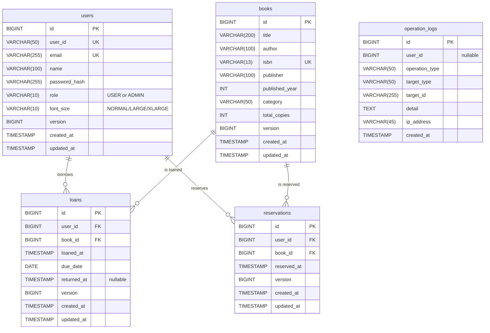

# ER図

## エンティティ関連図

## テーブル説明

### users（ユーザ）

| カラム名 | 型 | 制約 | 説明 |
|---------|-----|------|------|
| id | BIGINT | PK, AUTO | システム内部ID（主キー） |
| user_id | VARCHAR(50) | NOT NULL, UNIQUE | ログインID（ユーザが使用する識別子） |
| email | VARCHAR(255) | NOT NULL, UNIQUE | メールアドレス（ログイン時にも使用可能） |
| name | VARCHAR(100) | NOT NULL | 表示名 |
| password_hash | VARCHAR(255) | NOT NULL | BCryptでハッシュ化されたパスワード |
| role | VARCHAR(10) | NOT NULL, DEFAULT 'USER' | ロール（USER / ADMIN） |
| font_size | VARCHAR(10) | NOT NULL, DEFAULT 'NORMAL' | フォントサイズ設定（NORMAL / LARGE / XLARGE） |
| version | BIGINT | NOT NULL, DEFAULT 0 | 楽観的ロック用バージョン番号 |
| created_at | TIMESTAMP | NOT NULL, DEFAULT CURRENT_TIMESTAMP | 作成日時 |
| updated_at | TIMESTAMP | NOT NULL, DEFAULT CURRENT_TIMESTAMP | 更新日時 |

### books（図書）

| カラム名 | 型 | 制約 | 説明 |
|---------|-----|------|------|
| id | BIGINT | PK, AUTO | 図書ID（主キー） |
| title | VARCHAR(200) | NOT NULL | タイトル |
| author | VARCHAR(100) | NOT NULL | 著者名 |
| isbn | VARCHAR(13) | NOT NULL, UNIQUE | ISBN（10桁または13桁） |
| publisher | VARCHAR(100) | | 出版社名 |
| published_year | INT | | 出版年 |
| category | VARCHAR(50) | | カテゴリ |
| total_copies | INT | NOT NULL, DEFAULT 1 | 総蔵書数 |
| version | BIGINT | NOT NULL, DEFAULT 0 | 楽観的ロック用バージョン番号 |
| created_at | TIMESTAMP | NOT NULL, DEFAULT CURRENT_TIMESTAMP | 作成日時 |
| updated_at | TIMESTAMP | NOT NULL, DEFAULT CURRENT_TIMESTAMP | 更新日時 |

**注意**: `available_copies`（貸出可能冊数）はDBカラムとして持たず、`total_copies - 未返却の loans 件数` で動的に算出する。

### loans（貸出）

| カラム名 | 型 | 制約 | 説明 |
|---------|-----|------|------|
| id | BIGINT | PK, AUTO | 貸出ID（主キー） |
| user_id | BIGINT | NOT NULL, FK→users.id | 貸出ユーザのID |
| book_id | BIGINT | NOT NULL, FK→books.id | 貸出図書のID |
| loaned_at | TIMESTAMP | NOT NULL, DEFAULT CURRENT_TIMESTAMP | 貸出日時 |
| due_date | DATE | NOT NULL | 返却期限（貸出日から7日後） |
| returned_at | TIMESTAMP | NULL | 返却日時（未返却の場合はNULL） |
| version | BIGINT | NOT NULL, DEFAULT 0 | 楽観的ロック用バージョン番号 |
| created_at | TIMESTAMP | NOT NULL, DEFAULT CURRENT_TIMESTAMP | 作成日時 |
| updated_at | TIMESTAMP | NOT NULL, DEFAULT CURRENT_TIMESTAMP | 更新日時 |

### reservations（予約）

| カラム名 | 型 | 制約 | 説明 |
|---------|-----|------|------|
| id | BIGINT | PK, AUTO | 予約ID（主キー） |
| user_id | BIGINT | NOT NULL, FK→users.id | 予約ユーザのID |
| book_id | BIGINT | NOT NULL, FK→books.id | 予約図書のID |
| reserved_at | TIMESTAMP | NOT NULL, DEFAULT CURRENT_TIMESTAMP | 予約日時 |
| version | BIGINT | NOT NULL, DEFAULT 0 | 楽観的ロック用バージョン番号 |
| created_at | TIMESTAMP | NOT NULL, DEFAULT CURRENT_TIMESTAMP | 作成日時 |
| updated_at | TIMESTAMP | NOT NULL, DEFAULT CURRENT_TIMESTAMP | 更新日時 |

**予約順位**は `reserved_at` の昇順で決定し、同一図書に対して `returned_at IS NULL` でない先頭予約者から自動貸出が行われる。

### operation_logs（操作ログ）

| カラム名 | 型 | 制約 | 説明 |
|---------|-----|------|------|
| id | BIGINT | PK, AUTO | ログID（主キー） |
| user_id | BIGINT | NULL | 操作ユーザのID（未認証操作の場合はNULL） |
| operation_type | VARCHAR(50) | NOT NULL | 操作種別（LOGIN/LOGOUT/LOAN/RETURN等） |
| target_type | VARCHAR(50) | NOT NULL | 操作対象種別（USER/BOOK/LOAN/RESERVATION） |
| target_id | VARCHAR(255) | | 操作対象のID |
| detail | TEXT | | 操作詳細（JSON形式等） |
| ip_address | VARCHAR(45) | | クライアントIPアドレス（IPv6対応） |
| created_at | TIMESTAMP | NOT NULL, DEFAULT CURRENT_TIMESTAMP | ログ記録日時 |

## エンティティ間のリレーション

| リレーション | カーディナリティ | 説明 |
|------------|--------------|------|
| users → loans | 1:N | 1ユーザが複数の貸出を持てる |
| users → reservations | 1:N | 1ユーザが複数の予約を持てる |
| books → loans | 1:N | 1図書（タイトル）が複数の貸出を持てる（複数蔵書） |
| books → reservations | 1:N | 1図書に対して複数の予約が存在できる |

## 設計上の補足

- **available_copies の動的算出**: `books.total_copies - COUNT(loans WHERE book_id = books.id AND returned_at IS NULL)`
- **延滞判定**: `loans.due_date < CURRENT_DATE AND returned_at IS NULL`
- **予約順位**: 同一 `book_id` の `reservations` を `reserved_at` 昇順で並べたときの順序
- **楽観的ロック対象**: users, books, loans, reservations の4テーブル（全更新・削除操作で version チェックを行う）
