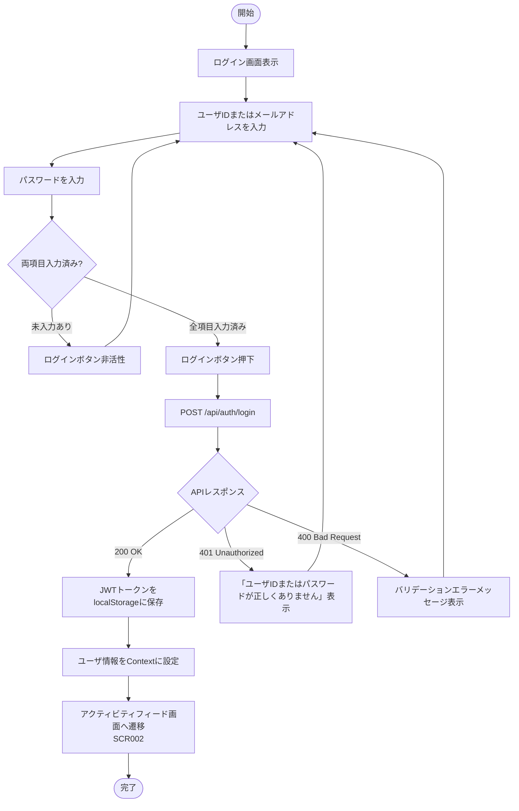

# アクティビティ図

## 1. 貸出フロー

```mermaid
flowchart TD
    A([開始]) --> B[図書詳細画面を開く]
    B --> C[GET /api/books/{id} で図書情報取得]
    C --> D{在庫確認\navailableCopies > 0?}
    D -- 在庫なし --> E{延滞中ユーザ?}
    D -- 在庫あり --> F{貸出上限到達?\ncurrentLoanCount >= 5}
    E -- 延滞中 --> G[予約ボタン非活性\n延滞中メッセージ表示]
    E -- 延滞なし --> H{既予約?}
    H -- 既予約 --> I[予約キャンセルボタン表示]
    H -- 未予約 --> J[予約ボタン活性表示]
    J --> K[ユーザが予約ボタン押下]
    K --> L[POST /api/reservations]
    L --> M{APIレスポンス}
    M -- 201 Created --> N[予約完了\nスナックバー表示]
    M -- 409 Conflict --> O[エラーメッセージ表示]
    F -- 上限到達 --> P[貸出ボタン非活性\n上限メッセージ表示]
    F -- 上限未到達 --> Q{延滞中ユーザ?}
    Q -- 延滞中 --> R[貸出ボタン非活性\n延滞中メッセージ表示]
    Q -- 延滞なし --> S[貸出ボタン活性表示]
    S --> T[ユーザが貸出ボタン押下]
    T --> U[POST /api/loans]
    U --> V{APIレスポンス}
    V -- 201 Created --> W[貸出完了\nスナックバー表示\n画面リロード]
    V -- 409 Conflict --> X[エラーメッセージ表示]
    W --> Y([完了])
    N --> Y
```

## 2. 返却フロー

```mermaid
flowchart TD
    A([開始]) --> B[ダッシュボード/貸出履歴画面を開く]
    B --> C[GET /api/me/loans で貸出一覧取得]
    C --> D[貸出中図書一覧を表示]
    D --> E[ユーザが返却ボタン押下]
    E --> F[PUT /api/loans/{id}/return\nversion をリクエストに含める]
    F --> G{APIレスポンス}
    G -- 200 OK --> H[returned_at をセット]
    H --> I[available_copies を+1\n動的算出値が更新される]
    I --> J{予約キュー確認\n同図書の reservations が存在?}
    J -- 予約あり --> K[予約順位1位のユーザを特定]
    K --> L[自動貸出レコード作成\nPOST /api/loans for reservation holder]
    L --> M[予約レコード削除\nDELETE reservations]
    M --> N[返却・自動貸出完了\nスナックバー表示]
    J -- 予約なし --> O[返却完了\nスナックバー表示]
    G -- 409 Conflict\n楽観的ロックエラー --> P[「他の端末から変更が行われました。\n再読み込みしてください。」表示]
    G -- 404 Not Found --> Q[エラーメッセージ表示]
    N --> R([完了])
    O --> R
```

## 3. 予約フロー

```mermaid
flowchart TD
    A([開始]) --> B[図書詳細画面を開く]
    B --> C[GET /api/books/{id} で図書情報取得]
    C --> D{在庫確認\navailableCopies > 0?}
    D -- 在庫あり --> E[予約ボタン非表示\n貸出ボタン表示]
    D -- 全冊貸出中 --> F{延滞中ユーザ?}
    F -- 延滞中 --> G[予約ボタン非活性\n「延滞中のため予約できません」表示]
    F -- 延滞なし --> H{既に同図書を予約済み?}
    H -- 既予約 --> I[予約キャンセルボタン表示]
    H -- 未予約 --> J[予約ボタン活性表示]
    J --> K[ユーザが予約ボタン押下]
    K --> L[POST /api/reservations\nbookId をリクエストに含める]
    L --> M{APIレスポンス}
    M -- 201 Created --> N[予約完了\n予約順位をスナックバー表示\n画面リロード]
    M -- 409 Conflict\n在庫あり --> O[「在庫があるため予約できません」表示]
    M -- 409 Conflict\n延滞中 --> P[「延滞中のため予約できません」表示]
    M -- 409 Conflict\n重複予約 --> Q[「すでにこの図書を予約しています」表示]
    N --> R([完了])
```

## 4. ログインフロー


