# ユースケース図

## システムユースケース図

```mermaid
flowchart LR
    subgraph Actors["アクター"]
        UA["👤 通常ユーザ"]
        AA["👨‍💼 管理者ユーザ"]
    end

    subgraph System["図書管理システム"]
        subgraph Auth["認証・セッション管理"]
            UC01["ログイン\n(FR-001)"]
            UC02["ログアウト\n(FR-002)"]
            UC03["セッション管理\n(FR-003)"]
        end

        subgraph Profile["プロフィール管理"]
            UC04["プロフィール閲覧・編集\n(FR-004)"]
            UC05["パスワード変更\n(FR-005)"]
            UC06["フォントサイズ変更\n(FR-006)"]
        end

        subgraph BookBrowse["図書閲覧"]
            UC07["図書検索・一覧表示\n(FR-007)"]
            UC08["図書詳細表示\n(FR-008)"]
        end

        subgraph BookOps["図書操作"]
            UC09["図書貸出\n(FR-012)"]
            UC10["図書返却\n(FR-013)"]
            UC11["図書予約\n(FR-017)"]
            UC12["予約キャンセル\n(FR-031)"]
        end

        subgraph History["履歴・ダッシュボード"]
            UC13["貸出履歴確認\n(FR-019)"]
            UC14["ダッシュボード閲覧\n(FR-020)"]
            UC15["アクティビティフィード閲覧\n(FR-021)"]
        end

        subgraph AdminBook["図書管理（ADMIN）"]
            UC16["図書登録\n(FR-009)"]
            UC17["図書編集\n(FR-010)"]
            UC18["図書削除\n(FR-011)"]
        end

        subgraph AdminUser["ユーザ管理（ADMIN）"]
            UC19["ユーザ登録\n(FR-022)"]
            UC20["ユーザ編集\n(FR-023)"]
            UC21["ユーザ削除\n(FR-024)"]
            UC22["ユーザPW再設定\n(FR-025)"]
        end
    end

    %% 通常ユーザのユースケース
    UA --> UC01
    UA --> UC02
    UA --> UC03
    UA --> UC04
    UA --> UC05
    UA --> UC06
    UA --> UC07
    UA --> UC08
    UA --> UC09
    UA --> UC10
    UA --> UC11
    UA --> UC12
    UA --> UC13
    UA --> UC14
    UA --> UC15

    %% 管理者ユーザは通常ユーザの全ユースケースに加えて管理機能も持つ
    AA --> UC01
    AA --> UC02
    AA --> UC03
    AA --> UC04
    AA --> UC05
    AA --> UC06
    AA --> UC07
    AA --> UC08
    AA --> UC09
    AA --> UC10
    AA --> UC11
    AA --> UC12
    AA --> UC13
    AA --> UC14
    AA --> UC15
    AA --> UC16
    AA --> UC17
    AA --> UC18
    AA --> UC19
    AA --> UC20
    AA --> UC21
    AA --> UC22
```

## ユースケース一覧

### 通常ユーザ（A-001）のユースケース

| ユースケースID | ユースケース名 | 関連FR | 説明 |
|-------------|-------------|--------|------|
| UC01 | ログイン | FR-001 | ユーザIDまたはメールアドレスとパスワードでシステムにログインする |
| UC02 | ログアウト | FR-002 | システムからログアウトし、セッションを終了する |
| UC03 | セッション管理 | FR-003 | 30分非操作でタイムアウト。多重ログイン防止 |
| UC04 | プロフィール閲覧・編集 | FR-004 | 自分の表示名を変更する |
| UC05 | パスワード変更 | FR-005 | 現在のパスワードと新パスワードを入力して変更する |
| UC06 | フォントサイズ変更 | FR-006 | UI全体のフォントサイズを標準/大/特大から選択する |
| UC07 | 図書検索・一覧表示 | FR-007 | タイトル・著者・カテゴリ・ISBNで図書を検索する |
| UC08 | 図書詳細表示 | FR-008 | 図書の詳細情報・在庫状況を確認する |
| UC09 | 図書貸出 | FR-012 | 在庫がある図書を貸し出す（最大5冊・延滞中不可） |
| UC10 | 図書返却 | FR-013 | 貸出中の図書を返却する |
| UC11 | 図書予約 | FR-017 | 全冊貸出中の図書を予約する（延滞中不可） |
| UC12 | 予約キャンセル | FR-031 | 予約中の図書の予約をキャンセルする |
| UC13 | 貸出履歴確認 | FR-019 | 自分の貸出履歴（返却済含む）を確認する |
| UC14 | ダッシュボード閲覧 | FR-020 | 現在の貸出状況サマリと貸出中図書一覧を確認する |
| UC15 | アクティビティフィード閲覧 | FR-021 | 最新の貸出・返却・予約アクティビティをタイムライン表示で確認する |

### 管理者ユーザ（A-002）の追加ユースケース

| ユースケースID | ユースケース名 | 関連FR | 説明 |
|-------------|-------------|--------|------|
| UC16 | 図書登録 | FR-009 | 新しい図書（タイトル・著者・ISBN等）を登録する |
| UC17 | 図書編集 | FR-010 | 既存図書の情報を更新する（楽観的ロック適用） |
| UC18 | 図書削除 | FR-011 | 図書を削除する（楽観的ロック適用） |
| UC19 | ユーザ登録 | FR-022 | 新規ユーザアカウントを作成する |
| UC20 | ユーザ編集 | FR-023 | 既存ユーザの情報（名前・メール・ロール）を更新する |
| UC21 | ユーザ削除 | FR-024 | ユーザアカウントを削除する |
| UC22 | ユーザPW再設定 | FR-025 | 管理者がユーザのパスワードを強制的に再設定する |

**注意**: 管理者ユーザ（A-002）は通常ユーザ（A-001）の全ユースケース（UC01〜UC15）も実行可能。

## ユースケース間の関係

| 関係 | ユースケース | 説明 |
|------|------------|------|
| 包含 (include) | 図書貸出 ← 延滞確認 | 貸出時に延滞チェックを必ず実行 |
| 包含 (include) | 図書貸出 ← 貸出上限確認 | 貸出時に5冊上限チェックを必ず実行 |
| 包含 (include) | 図書予約 ← 延滞確認 | 予約時に延滞チェックを必ず実行 |
| 拡張 (extend) | 図書返却 → 自動貸出 | 返却時に予約者がいる場合、自動で貸出処理を実行 |
| 拡張 (extend) | ログイン → セッション無効化 | 多重ログイン時に既存セッションを無効化 |
